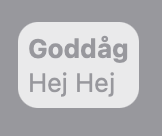
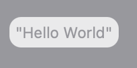
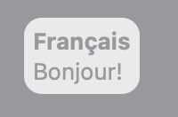
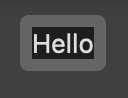

# SUEModifier

SwiftUI View modifiers

<p align="center">
<a href="LICENSE.md">
    
</a>
<a href="https://swift.org">
    
</a>

SUE stands for *S*wift*U*I *E*xtras and is a collection of small SwiftUI libraries for various recurring use cases

## Gallery

### ConditionalOverlay
```swift
Rectangle().foregroundColor(.gray)
    .overlay($hidden, Text("Hej Hej").overlayStyle("Goddåg"))
```


### ObservingOverlay
```swift
Rectangle().foregroundColor(.gray)
    .overlay(Demo(), keyPath: \Demo.test)
```


### OverlayStyle
```swift
Rectangle().foregroundColor(.gray)
    .overlay(Text("Bonjour!").overlayStyle("Français"))
```



### Hideable
```swift
HStack{
    Text("Hello").hide($hidden1)
    Text(" World").hide($hidden2)
}
```



## License

MIT license; see [LICENSE](LICENSE.md).
(c) 2020
